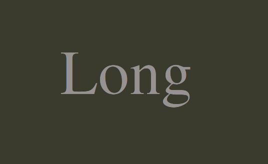

<h1 align="center">
Project Gaia
</h1>

 

 

## Demo Page

[ Demo Page](https://szhielelp.github.io/JekyllTheme-ProjectGaia/#/)

## Documents

[    Documents    ](https://szhielelp.github.io/JekyllTheme-ProjectGaia-Docs/#/)

## Author

👤 **szhshp**

* Github: [@szhielelp](https://github.com/szhielelp)
* Blog: [http://szhshp.org](http://szhshp.org)

## Show your support

Give a ⭐️ if this project helped you!
